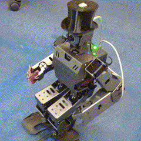

# BREW NAVIGATION HAT

GNSS Navigation System for Baby Brewie Humanoid Robot

## Project for Outdoor Navigation 
This is our first attempt to take Baby Brewie beyond the confines of home! The system allows the robot to plot a route on a map and follow designated waypoints.

We're still teaching the robot how to walk, so reactions to external events and more flexible route planning are still in development. Nevertheless, we're ready for our first journey!

## Hardware Modifications

Baby Brewie already comes equipped with sensors such as a camera, IMU, and magnetometer. However, full outdoor positioning requires an additional navigation module.

We chose the [m10q-5883](https://www.amazon.com/SEQURE-QMC5883L-Generation-Satellite-Positioning/dp/B0D7Q27CT1/ref=sr_1_1_sspa?dib=eyJ2IjoiMSJ9.jlcnhNQRlH3o-y2BIEbsQQNZcIPBubezLJw1O1g2KxPrWwBrviAeHA2hbdbgYx_6FCcfFhE_djhfPpoK4UQ7rQ.jWLKipKZi6yJKajP8wiL6kxLyVs6sYejv4COSPA7GUk&dib_tag=se&keywords=m10q-5883&qid=1748936161&sr=8-1-spons&sp_csd=d2lkZ2V0TmFtZT1zcF9hdGY&th=1), which combines high accuracy with flexible configuration. It supports both GPS and BeiDou satellite systems. The module also includes an external magnetic compass, which can be positioned further away from the robot's body to reduce interference (the top hat looks cool, right?).

You can use any other compatible GNSS module that supports the NMEA protocol and provides positioning accuracy within 1 meter. The magnetometer can be connected as a separate sensor.

We use an Arduino as the sensor interface to transmit data to the robot. It also allows for future onboard data processing.

## Device Mounting

To ensure the sensors integrate well with the robot's appearance, we designed a top hat mount that attaches to Brewie's head. The cylinder is fixed onto a plastic plate that attaches to the robot's standard head screws. This way, you can 3D-print everything needed without modifying the robot itself!

## Software Interface

Since we use an Arduino to manage the sensors (running custom firmware), we also created a ROS node to publish sensor data. We created two topics:

/fix for GNSS data

/mag for magnetometer readings

For simplicity in version 1, we use standard topic structures. The robot's magnetic azimuth (calculated on the Arduino) is sent through the Z-axis of the magnetometer data.

## Navigation

The first version of the navigation algorithm calculates the robot's position using sensor data and moves it toward specified waypoints using built-in kinematic functions. The parameter TOLERANCE sets the allowable margin of error for reaching a waypoint.

Currently, the robot cannot detect or avoid obstacles—it moves in a straight line between waypoints, turning as needed. Use caution and ensure there are no obstacles between the points you define.

## Interface

A simple web interface has been created for easy control and monitoring. It shows the robot's location on a map, its orientation, and allows route planning. The device running the web app must be on the same network as the robot, and the correct IP address must be set. Standard ROS sockets are used.

An upcoming update will allow you to start navigation directly from the web interface and will include a more user-friendly tool for route building.

## Roadmap

[ ] Add fall detection and auto-recovery so the robot can get up and continue its route.

[ ] Integrate a computer vision module to detect obstacles and other events.

[ ] Add LIDAR for improved navigation and obstacle avoidance.

[ ] Improve UI/UX.

[ ] Implement a stair-climbing algorithm (including robot's hardware capabilities).

## Contact & Contributions

PRs, suggestions, and forks welcome!

Maintained by the [Homebrew Robotics Club](https://github.com/homebrew-robotics-club)

&nbsp;
